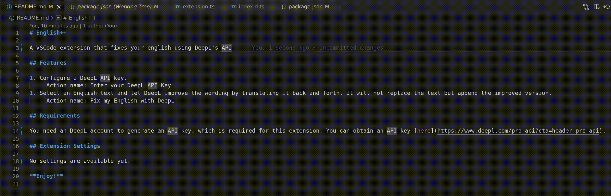

# English++

A VSCode extension that fixes your English with DeepL's API

## Features

1. Configure a DeepL API key.
   - Action name: Enter your DeepL API Key
1. Select an English text and let DeepL improve the wording by translating it back and forth. It will not replace the text but append the improved version.
   - Action name: Fix my English with DeepL

## Requirements

You need an DeepL account to generate an API key, which is required for this extension. You can obtain an API key [here](https://www.deepl.com/pro-api?cta=header-pro-api).

## Extension Settings

No settings are available yet.

**Enjoy!**
